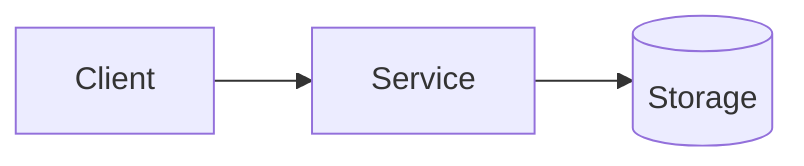

# Context Management Templates

Context management is critical for AI agent workflows, especially across multiple sessions. These templates provide structured approaches for maintaining context, tracking progress, and documenting decisions.

## Template Overview

| Template | Purpose | When to Use |
|----------|---------|-------------|
| **Tasks & Planning** | Track current and historical tasks | At project start and throughout development |
| **Active Context** | Document current focus and decisions | Before each session, update during work |
| **Progress Tracking** | Monitor completion and velocity | Daily/weekly for multi-session projects |
| **Project Brief** | High-level project overview | At project start, reference throughout |
| **Creative Design** | Document design decisions | When choosing between implementation approaches |
| **Design Document** | Detailed technical design | For complex features requiring architecture |
| **PRD** | Product requirements | For new features/projects |
| **Reflect** | Post-implementation review | After completing significant work |

---

## Template 1: Tasks & Planning

Track current work, complexity, and task history.

```markdown
# Tasks & Planning

## Current Task
- **Status:** Not Started
- **Description:**
- **Complexity:** TBD (1-4)
- **Files Affected:**
- **Plan:**
- **Progress:**
- **Notes:**

## Task History

### Completed Tasks
-

### In Progress
-

### Planned
-

---

## Complexity Levels Reference

- **Level 1:** Simple fixes (typos, single-line changes)
- **Level 2:** Single feature/module changes
- **Level 3:** Multi-module changes, significant features
- **Level 4:** Architectural changes, major refactoring

---

## Notes
[Any project-specific notes or context]
```

**Usage with Claude Code:**

- Create `.claude/tasks.md` in your project root
- Update status as work progresses
- Reference in prompts: "Check .claude/tasks.md for current status"

---

## Template 2: Active Context

Document current focus, decisions, and handoff information.

```markdown
# Active Context

## Current Phase
Not Started

**Phases:**
- Planning: Designing solution, waiting for approval
- Implementing: Actively coding
- Reviewing: Reviewing completed work
- Complete: Task finished

## Current Focus
[What we're working on right now]

## Key Decisions
- [Decision]: [Rationale]

## Blockers/Issues
- [Issue]: [Status/Resolution]

## Context from Previous Sessions
[Any important context that needs to be remembered]

## Handoff Bundle (copy/paste)

Goal:
Non-goals:
Constraints:
Current state:
Next 3 actions:
Key files/paths:
Key commands + outputs (verbatim, minimal):
```

**Usage with Claude Code:**

- Create `.claude/active-context.md` in your project
- Update before starting each session
- Use handoff bundle when switching agents or resuming work
- Reference in prompts: "See .claude/active-context.md for current state"

---

## Template 3: Progress Tracking

Monitor completion status and velocity.

```markdown
# Progress Tracking

## Completed
- [Task]: [Date] - [Brief summary]

## In Progress
- [Current task]: [Status update]

## Next Steps
- [Next task 1]
- [Next task 2]

## Blocked/Waiting
- [Blocked task]: [Reason]

---

## Metrics (Optional)
- Tasks completed this week:
- Average task duration:
- Current velocity:
```

**Usage with Claude Code:**

- Create `.claude/progress.md` for multi-day projects
- Update daily or after completing tasks
- Helps Claude understand project momentum

---

## Template 4: Project Brief

High-level overview of project architecture and conventions.

```markdown
# Project Brief

## Purpose
[What this project does, its main goal]

## Tech Stack
- **Languages:**
- **Frameworks:**
- **Infrastructure:**
- **Tools:**

## Architecture Overview
[High-level architecture description]

## Key Patterns & Conventions
- [Pattern 1]: [Description]
- [Pattern 2]: [Description]

## Important Notes
- [Note 1]
- [Note 2]

## Team/Contact
- [Team members or contact info]

## Related Documentation
- [Links to other docs]
```

**Usage with Claude Code:**

- Create at project root or in `.claude/project-brief.md`
- Reference when onboarding new AI sessions
- Include in prompts: "Review project-brief.md for architecture"

---

## Template 5: Creative Design

Document design decisions and trade-offs.

```markdown
# Creative: [Component/Feature Name]

**Date:** [Date]
**Task:** [Related task reference]

## Design Challenge
[What design decision needs to be made]

## Options Considered

| Option | Pros | Cons | Complexity | Decision |
|--------|------|------|------------|----------|
| Option A | ... | ... | Low/Med/High | ✅ Chosen / ❌ Rejected |
| Option B | ... | ... | Low/Med/High | ✅ Chosen / ❌ Rejected |
| Option C | ... | ... | Low/Med/High | ✅ Chosen / ❌ Rejected |

## Rationale
[Why the chosen option was selected]

## Trade-offs Accepted
- [Trade-off 1]: [Why it's acceptable]
- [Trade-off 2]: [Why it's acceptable]

## Implementation Notes
[Key considerations for implementing the chosen option]

## References
- [Link to relevant docs/patterns]
- [Related decisions]
```

**Usage with Claude Code:**

- Use when multiple approaches are viable
- Ask Claude: "Help me fill out a creative design doc for [feature]"
- Save in `.claude/designs/` directory

---

## Template 6: Design Document

Detailed technical design for complex features.

```markdown
# Design

## TL;DR
[One paragraph summary of the approach.]

## Context
- **Link to PRD**: `extras/prd.md`
- **Current state**: [what exists today]
- **Desired state**: [what will exist after]

## Goals / non-goals
### Goals
- [Goal 1]

### Non-goals
- [Non-goal 1]

## Options considered
| Option | Summary | Pros | Cons | Decision |
|---|---|---|---|---|
| A | [Approach] | [Pros] | [Cons] | [Chosen/Rejected] |
| B | [Approach] | [Pros] | [Cons] | [Chosen/Rejected] |

## Proposed architecture
### Components
- [Component 1]: [responsibility]
- [Component 2]: [responsibility]

### Data flow
[Describe request/data flow. Add a Mermaid diagram if helpful.]



## Interfaces & contracts

- **APIs / CLIs**: [endpoints, commands, inputs/outputs]
- **Data model**: [schemas, migrations]
- **Backward compatibility**: [what breaks, what's preserved]

## Security & privacy

- **AuthN/AuthZ**: [who can do what]
- **Data handling**: [PII, secrets, encryption]
- **Threats**: [top risks + mitigations]

## Observability & operations

- **Logging**: [key events, redaction]
- **Metrics**: [SLIs/SLOs, dashboards]
- **Alerts**: [what pages and why]
- **Runbooks**: [links/locations]

## Rollout plan

- [Feature flags]
- [Migration steps]
- [Backout plan]

## Test plan

- [Unit tests]
- [Integration tests]
- [Manual validation]

## Risks

- [Risk 1] → [Mitigation]
- [Risk 2] → [Mitigation]

```

**Usage with Claude Code:**
- For Level 3-4 complexity tasks
- Ask: "Create a design doc for [feature] following the template"
- Save in `docs/designs/` or `.claude/designs/`

---

## Template 7: PRD (Product Requirements Document)

Define product requirements and success criteria.

```markdown
# PRD

## Problem statement
[What problem are we solving and for whom?]

## Goals
- [Goal 1]
- [Goal 2]

## Non-goals
- [Non-goal 1]
- [Non-goal 2]

## Users & use cases
- **Primary user(s)**: [who]
- **Key use cases**:
  - [Use case 1]
  - [Use case 2]

## Requirements
### Functional requirements
- [Requirement 1]
- [Requirement 2]

### Non-functional requirements
- **Reliability**: [SLOs, error budgets, retry expectations]
- **Security**: [auth/authz, data classification, OWASP concerns]
- **Performance**: [p95/p99 targets, scale assumptions]
- **Operability**: [logging/metrics/alerts, runbooks]

## Constraints & assumptions
- **Constraints**: [time, infra, dependency, compliance]
- **Assumptions**: [what we're assuming; what changes if wrong]

## Success metrics
- [Metric 1]
- [Metric 2]

## Milestones
- [Milestone 1]
- [Milestone 2]

## Open questions
- [Question 1]
- [Question 2]
```

**Usage with Claude Code:**

- Define before starting large features
- Reference in design phase: "See prd.md for requirements"
- Save in `docs/` or `.claude/prd.md`

---

## Template 8: Reflect (Post-Implementation Review)

Document lessons learned and improvements.

```markdown
# Review: [Task Name]

**Date:** [Date]
**Task:** [Reference to original task]

## What Was Done
[Summary of what was implemented]

## Changes Made
- [Change 1]: [Description]
- [Change 2]: [Description]

## Lessons Learned
- [Lesson 1]: [What we learned]
- [Lesson 2]: [What we learned]

## What Went Well
- [Success 1]
- [Success 2]

## Challenges Encountered
- [Challenge 1]: [How it was resolved]
- [Challenge 2]: [How it was resolved]

## Improvements for Next Time
- [Improvement 1]: [Why it would help]
- [Improvement 2]: [Why it would help]

## Code Quality Notes
- [Quality observation 1]
- [Quality observation 2]

## Security Considerations
- [Security note 1]
- [Security note 2]

## Performance Impact
- [Performance note 1]
- [Performance note 2]

## Follow-up Actions
- [ ] [Action item 1]
- [ ] [Action item 2]
```

**Usage with Claude Code:**

- Complete after finishing significant tasks
- Ask: "Help me create a reflect doc for [completed task]"
- Save in `.claude/reviews/` or `docs/reviews/`

---

## Best Practices

### Context File Organization

```
.claude/
├── project-brief.md          # High-level overview (create once)
├── tasks.md                  # Current task tracking (update frequently)
├── active-context.md         # Session context (update each session)
├── progress.md               # Historical progress (update daily/weekly)
├── designs/                  # Design decisions
│   ├── feature-a.md
│   └── feature-b.md
└── reviews/                  # Post-implementation reviews
    ├── feature-a-review.md
    └── feature-b-review.md
```

### Working with Claude Code

1. **Start of Session**
   - Create or update `.claude/active-context.md`
   - Reference in prompt: "Review .claude/active-context.md for current state"

2. **During Development**
   - Update `.claude/tasks.md` as tasks complete
   - Document design decisions in creative/design docs

3. **End of Session**
   - Update handoff bundle in active-context.md
   - Update progress.md with completed work
   - Create reflect doc for significant completions

4. **Multi-Session Projects**
   - Keep project-brief.md up to date
   - Reference context files in each new session
   - Use handoff bundles to resume work efficiently

### Prompting Tips

```
"Before we start, review these context files:
- .claude/project-brief.md for architecture
- .claude/active-context.md for current state
- .claude/tasks.md for task list"

"Let's create a creative design doc for the authentication feature"

"Update .claude/progress.md with the work we just completed"

"Create a reflect doc for the API refactoring we finished"
```

---

## Integration with Agent Workflow

These templates integrate with the agent workflow phases:

- **Init/Plan Phase**: Use PRD, Design, and Creative templates
- **Build Phase**: Reference Tasks and Active Context
- **Review Phase**: Use Reflect template
- **Throughout**: Maintain Active Context and Progress tracking

See `agent-workflow/SKILL.md` for workflow phase details.
