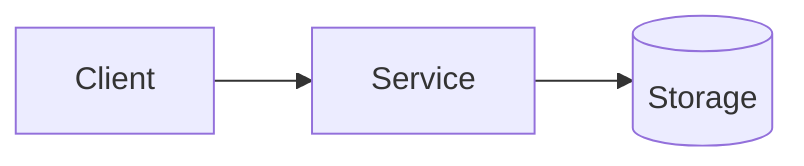

# Design

## TL;DR

[One paragraph summary of the approach.]

## Context

- **Link to PRD**: `extras/prd.md`
- **Current state**: [what exists today]
- **Desired state**: [what will exist after]

## Goals / non-goals

### Goals

- [Goal 1]

### Non-goals

- [Non-goal 1]

## Options considered

| Option | Summary | Pros | Cons | Decision |
|---|---|---|---|---|
| A | [Approach] | [Pros] | [Cons] | [Chosen/Rejected] |
| B | [Approach] | [Pros] | [Cons] | [Chosen/Rejected] |

## Proposed architecture

### Components

### Data flow

[Describe request/data flow. Add a Mermaid diagram if helpful.]

## Interfaces & contracts

- **APIs / CLIs**: [endpoints, commands, inputs/outputs]
- **Data model**: [schemas, migrations]
- **Backward compatibility**: [what breaks, what’s preserved]

## Security & privacy

- **AuthN/AuthZ**: [who can do what]
- **Data handling**: [PII, secrets, encryption]
- **Threats**: [top risks + mitigations]

## Observability & operations

- **Logging**: [key events, redaction]
- **Metrics**: [SLIs/SLOs, dashboards]
- **Alerts**: [what pages and why]
- **Runbooks**: [links/locations]

## Rollout plan

- [Feature flags]
- [Migration steps]
- [Backout plan]

## Test plan

- [Unit tests]
- [Integration tests]
- [Manual validation]

## Risks

- [Risk 1] → [Mitigation]
- [Risk 2] → [Mitigation]
