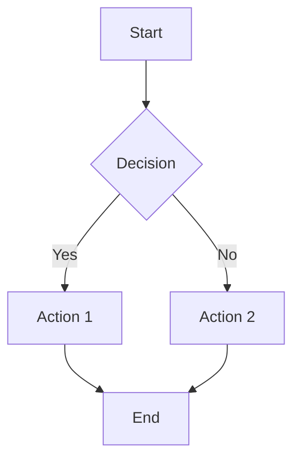
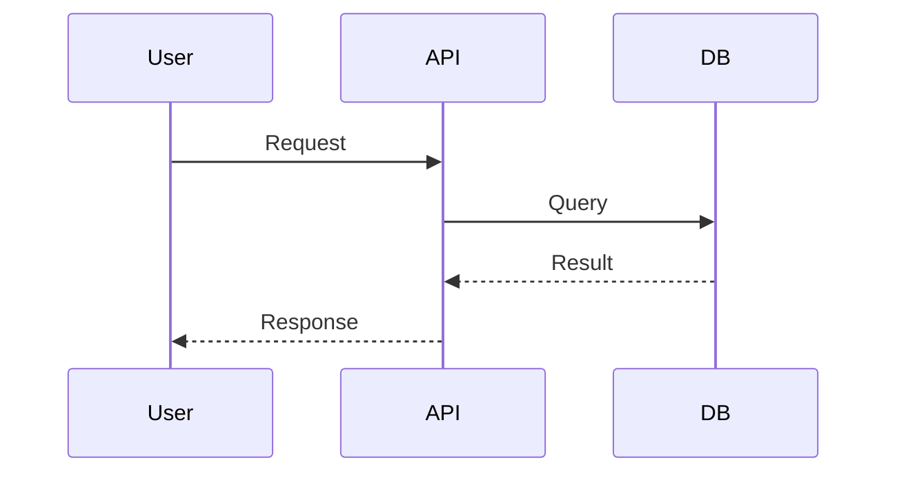
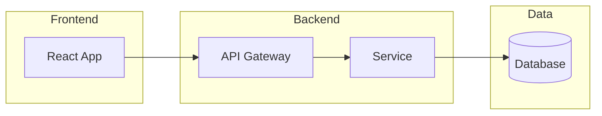

# Documentation Standards

## Core Principles

1. **Audience-First**: Write for your reader, not yourself
2. **Keep Current**: Outdated docs are worse than no docs
3. **Show, Don't Just Tell**: Use examples and diagrams
4. **Consistent Format**: Follow established patterns

## Hard Requirements (Writing)

- **No AI slop** - remove filler, keep docs concrete and task-oriented
- **No em dashes/en dashes** - use hyphens (`-`) instead
- **Clickable navigation** - if readers may want to open a repo file, directory, section, ADR, rule, skill, script, workflow, or config, make it a Markdown link. Use backticks only when the path is a literal value, not a navigation target.
- **Official terminology** - use each vendor's current official product and service names, capitalization, and branding. Verify uncertain names against current vendor documentation. For example, write **Amazon VPC**, not **AWS VPC**; write **AWS Lambda**, not **Amazon Lambda**. Do not apply one naming prefix mechanically across a provider's services.

## Voice

Prefer neutral/imperative phrasing - avoid "you/your" in professional docs.
Canonical guidance: `rules/810-documentation.mdc`.

## Diataxis Quick Guide

Use one primary documentation mode per page:

- **Tutorial** - learning by doing
- **How-to guide** - task completion
- **Reference** - factual lookup
- **Explanation** - concepts and rationale

Canonical Diataxis guidance lives in `rules/810-documentation.mdc`. Keep this skill concise and link back to the rule instead of duplicating detailed standards.

## README Structure

```markdown
# Project Name

Brief description of what this project does.

## Features

- Feature 1
- Feature 2

## Installation

```bash
npm install my-project
```

## Quick Start

```javascript
import { thing } from 'my-project';
thing.doSomething();
```

## Documentation

Link to full docs.

## Contributing

Link to CONTRIBUTING.md.

## License

MIT - See LICENSE.

```

## Markdown Best Practices

### Headers
- Use `#` hierarchy (don't skip levels)
- Keep headers concise
- Use title case for headings, preserving established acronyms and product names

### Code Blocks
````markdown
```python
def hello():
    print("Hello, World!")
```

````

### Lists
```markdown
- Unordered item
- Another item
  - Nested item

1. Ordered item
2. Another item
```

### Links and References
```markdown
[Link text](https://acme.com)
[Reference link][1]
[Python rule](../rules/200-python.mdc)
[Generation Contract](../rules/140-bash.mdc#generation-contract-for-non-trivial-scripts)

[1]: https://acme.com
```

Prefer clickable same-repo references:

- Good: `[Python skill](../skills/python-development/)`
- Avoid for navigation: `` `skills/python-development/` ``
- Good for literals: `` `src/app.ts` `` when discussing a path value or config example

### Tables
```markdown
| Header 1 | Header 2 |
|----------|----------|
| Cell 1   | Cell 2   |
```

## Interactive vs static diagrams

- **Static (Markdown):** Mermaid in this skill and in `rules/800-markdown.mdc`.
- **Interactive (React SPA):** `@xyflow/react` patterns, playbook, and rule **`rules/815-reactflow-diagrams.mdc`** - use skill **`skills/reactflow-architecture-diagrams/`**. See [references/static-vs-interactive.md](../reactflow-architecture-diagrams/references/static-vs-interactive.md) for a short comparison table.

### AI diagram tooling

Prefer tools that preserve a code-owned source of truth. Mermaid text in the repo is easiest to review, diff, and maintain.

| Tool | Best fit | Round-trip / ownership guidance |
|---|---|---|
| **Mermaid Chart AI** | Best fit for engineering-maintained diagrams | Generates/refines standard Mermaid and can export PNG, SVG, or MMD. Keep the `.mmd` / Mermaid block in the repo as source of truth. |
| **Eraser** | Good for nicer engineering visuals | Can import Mermaid and export PNG/SVG/PDF. Mermaid round-tripping is weaker, so treat exported Mermaid as a starting point and review manually. |
| **Lucidchart AI** | Good for polished business-friendly diagrams | Supports Mermaid input, but generated diagrams are not ideal for code-based round-tripping. Use for stakeholder diagrams, not canonical repo-maintained architecture diagrams. |
| **Napkin AI** | Best for presentation / infographic visuals | Exports PNG/SVG/PPT/PDF, but not Mermaid. Use for slides or narrative visuals, not engineering diagrams that must remain code-owned. |

Rule of thumb: if future maintainers need to edit it in Git, use Mermaid (or React Flow for interactive SPA diagrams). If the artifact is for a deck or executive narrative, exported visuals are acceptable as generated artifacts.

## Mermaid Diagrams

### Flowchart


### Sequence Diagram


### Architecture Diagram


## Technical Writing Tips

1. **Use active voice**: "The function returns a value" not "A value is returned"
2. **Be concise**: Remove unnecessary words
3. **Define acronyms**: Spell out on first use
4. **Use present tense**: "The function adds" not "The function will add"
5. **Include examples**: Show, don't just tell

## Detailed References

- **React Flow (interactive canvases)**: See `skills/reactflow-architecture-diagrams/SKILL.md` and `rules/815-reactflow-diagrams.mdc`
- **Markdown & Mermaid**: See [references/markdown-mermaid.md](references/markdown-mermaid.md)
- **Technical Writing**: See [references/technical-writing.md](references/technical-writing.md)
- **Open Source**: See [references/open-source.md](references/open-source.md)
