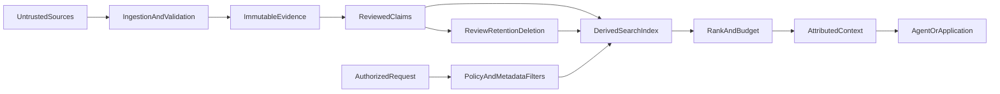

# Memory Architecture

Design persistent memory as a governed knowledge system, not as a larger prompt. Separate evidence from claims, choose storage from durability and trust requirements, filter before retrieval, cite what is used, and measure whether memory improves outcomes.

## When to Use

Use this skill for:

- Agent or assistant memory that persists across sessions
- Durable project or team knowledge bases
- Retrieval pipelines that assemble context automatically
- Note deduplication, contradiction handling, supersession, or retention
- Security and privacy reviews of persistent AI memory

Do not use it for:

- One-off questions or ordinary documentation
- Current-task handoff files such as `tmp/active-context.md`
- Web research refreshes whose storage architecture is already defined
- Model-provider API syntax without a memory-system design decision

For temporary coding-agent context, use [agent workflow context management](../agent-workflow/references/context-management.md). For bounded web refreshes, use [web-research-kb-refresh](../web-research-kb-refresh/). For trust-boundary reviews, compose with [zero-trust](../zero-trust/).

## Non-Negotiables

1. **Raw input is untrusted evidence, not ground truth.** Preserve its provenance and scan it for prompt injection, sensitive data, and malformed content.
2. **Ephemeral context is not durable memory.** A gitignored `tmp/` directory is appropriate for replaceable session state, not the only copy of team knowledge.
3. **Evidence and claims are separate records.** A claim cites evidence; changing a claim does not rewrite the source.
4. **Trust never escalates automatically.** Models and background jobs may propose claims or flag conflicts, but only an authorized human or deterministic policy may approve higher-trust states.
5. **Tenant and authorization filters run before semantic retrieval.** Similarity does not grant access.
6. **Similarity is a candidate signal.** It does not prove duplication, agreement, or contradiction.
7. **Supersession preserves lineage.** Do not move or delete records in a way that breaks stable identifiers and citations.
8. **Every retrieved claim is attributable.** Return stable claim IDs and source citations with generated context.
9. **Deletion is a designed operation.** Remove the canonical record, derived chunks, embeddings, caches, and replicas according to policy.
10. **Quality is measured.** Evaluate retrieval relevance, groundedness, freshness, conflict handling, and isolation before calling the system reliable.

## Architecture Decision Workflow

### 1. Classify the Memory Need

Choose one primary class before selecting technology:

| Class | Lifetime | Typical storage | Examples |
|---|---|---|---|
| Session context | Hours or days; replaceable | Gitignored local files or session store | Current task, handoff, temporary plan |
| Durable local knowledge | Months; single operator or repository | Versioned files or local database with backup | Decisions, project facts, curated notes |
| Shared or production memory | Policy-defined; multi-user or multi-agent | Authorized database, object store, and search index | Team KB, customer memory, operational knowledge |

If the requested persistence, recovery, sharing, or access controls do not match the proposed store, stop and redesign the storage layer.

### 2. Define the Trust and Data Boundaries

Record:

- Principals: writers, reviewers, retrievers, administrators, and downstream agents
- Tenants and authorization scopes
- Data classifications, including personal data, secrets, and regulated data
- Evidence sources and external processing, including embedding providers
- Retention, deletion, legal hold, backup, and recovery requirements
- Worst-case outcomes from poisoned, stale, leaked, or cross-tenant memory

See [security and privacy](references/security-and-privacy.md) for the threat model and control checklist.

### 3. Separate the Planes

- **Evidence plane:** original content plus source identity, hash, acquisition time, and classification
- **Knowledge plane:** atomic claims, review state, confidence rationale, validity, and evidence links
- **Index plane:** replaceable chunks, keywords, and embeddings derived from authorized records
- **Context plane:** request-specific, token-bounded, attributed material assembled after policy checks
- **Lifecycle plane:** review, conflict resolution, supersession, retention, deletion, and reindexing

### 4. Define the Record Contract

Require stable IDs and enough metadata to answer:

- What is the claim?
- Which evidence supports it?
- Who or what created and approved it?
- Which tenant and classification own it?
- When was it valid, reviewed, and retrieved?
- What supersedes or conflicts with it?
- When must it be reviewed or deleted?

Use [the data model](references/data-model.md) as a starting contract. Extend it for the domain instead of weakening its provenance or isolation fields.

### 5. Design Retrieval

Apply the retrieval sequence in this order:

1. Authenticate the caller and resolve tenant, purpose, and policy.
2. Apply authorization, classification, validity, retention, and deletion filters.
3. Generate candidates with keyword, metadata, graph, or embedding retrieval.
4. Rerank using relevance, evidence authority, freshness requirements, and review state.
5. Detect incompatible claims and surface unresolved conflicts.
6. Enforce a context token budget and diversity limits.
7. Return claim IDs, source citations, and ranking reasons with the selected context.

Do not use a universal ranking such as `human_confirmed > inferred > raw`. Authority and freshness depend on the claim, source, domain, and request. See [retrieval and evaluation](references/retrieval-and-evaluation.md).

### 6. Design Writes and Lifecycle

- Validate and classify before storing.
- Make ingestion idempotent with stable source IDs and content hashes.
- Treat similarity matches as review candidates.
- Keep conflict state separate from supersession state.
- Use optimistic concurrency or version checks for reviewed records.
- Rebuild derived indexes after approval, supersession, deletion, or policy changes.
- Archive only when policy permits; never use archival to evade deletion.
- Audit writes, approvals, retrievals, conflicts, exports, and deletions.

For a lightweight repository implementation, use [the local-file pattern](references/local-file-pattern.md).

### 7. Define Evaluation and Exit Criteria

Before rollout, create a representative query set with expected claims and prohibited results. Measure:

- Retrieval precision and recall at the configured context budget
- Citation and claim groundedness
- Stale or superseded claim retrieval rate
- Conflict detection and surfacing rate
- Cross-tenant and unauthorized retrieval rate, which must be zero
- Deletion propagation across canonical and derived stores
- Latency, index freshness, token use, and cost

Test poisoning, malicious source instructions, ambiguous identity, stale claims, conflicting approved claims, index lag, provider outage, and deletion failure.

## Design Review Output

Produce:

1. Memory class and storage decision with rejected alternatives
2. Principals, tenants, data classifications, and trust boundaries
3. Evidence and claim schemas
4. Ingestion, retrieval, write, conflict, and deletion flows
5. Security and privacy controls
6. Evaluation dataset, metrics, thresholds, and rollback criteria
7. Open risks, owners, and reversal conditions

## References

- [Data model](references/data-model.md)
- [Retrieval and evaluation](references/retrieval-and-evaluation.md)
- [Security and privacy](references/security-and-privacy.md)
- [Local-file pattern](references/local-file-pattern.md)

## Related Handbook Guidance

- [Context engineering rule](../../rules/015-context-engineering.mdc)
- [Zero Trust rule](../../rules/316-zero-trust.mdc)
- [AI and machine learning rule](../../rules/500-ai-ml.mdc)
- [Agent workflow skill](../agent-workflow/)
- [Web-research KB refresh skill](../web-research-kb-refresh/)
- [Zero Trust skill](../zero-trust/)
