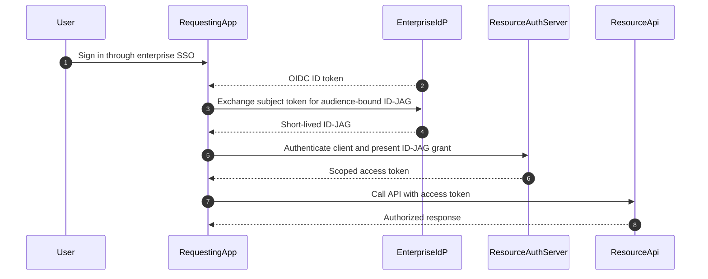

# Okta Cross App Access

Cross App Access (XAA) enables an enterprise identity provider to broker a managed, directional relationship between a requesting application and a resource application. It is relevant to SaaS-to-SaaS and agent-on-behalf-of-user access.

> [!IMPORTANT]
> XAA means **Cross App Access**, not “Extensible Access Architecture.” Okta currently documents XAA as Early Access. The legacy Manage Connections configuration is being removed; use the Resource server tab for current connector configuration. Verify current entitlement, supported integration types, configuration surfaces, and draft protocol details before implementation.

## Actors

- **User:** The subject on whose behalf access is requested.
- **Requesting app:** The client that needs a protected resource.
- **Enterprise IdP:** Authenticates the user, evaluates enterprise policy, and issues the intermediary Identity Assertion Authorization Grant (ID-JAG).
- **Resource app authorization server:** Validates the ID-JAG and requesting client, then issues a scoped access token.
- **Resource server:** Enforces the access token on the protected API.
- **Okta administrator:** Establishes and governs the managed directional connection.

The requesting and resource applications remain distinct OAuth clients and trust domains. XAA does not make one application's token valid at another application.

## Flow

Verify the current grant types, token-type identifiers, discovery metadata, client authentication, and required claims from the applicable Okta and draft specification versions. Do not copy constants from an old example.

## Security Contract

- Validate signature, issuer, audience, subject, client/actor binding, lifetime, and required policy context at the correct authorization server.
- Bind the ID-JAG audience to the intended resource authorization server; reject substitution across resource apps or tenants.
- Issue a least-privilege access token for the requested resource and action. Do not copy broad user entitlements into every downstream token.
- Keep intermediary grants and access tokens short-lived and out of logs, browser storage, prompts, model context, and analytics.
- Prevent replay according to the current profile; bind grants to the requesting client and use proof-of-possession when the supported profile requires it.
- Separate user authentication, enterprise approval of the managed connection, requesting-client authentication, resource authorization, and API enforcement.
- Audit both exchanges and the resource call with a correlation ID while redacting token values.

## Revocation and Incident Response

Disabling a managed XAA connection blocks new ID-JAG exchanges. It does not by itself prove that access tokens already issued by the resource application are revoked.

Define:

- ID-JAG and access-token maximum lifetimes;
- resource-app token revocation or session invalidation;
- requesting-client disablement and credential rotation;
- user/session revocation behavior;
- cross-domain incident contacts and a coordinated kill switch;
- evidence that new exchanges fail and existing downstream access has expired or been invalidated.

Until coordinated revocation is proven end-to-end, short lifetimes and resource-app invalidation are the containment controls.

## Rollout

1. Verify current Okta entitlement, integration prerequisites, and supported OIDC/SAML paths.
2. Register requesting and resource applications and establish their direct OAuth client relationship.
3. Configure the resource server connector from the Resource server tab with exact resource URL, issuer URL, audience/tenant ID, and client identifiers.
4. Test successful exchange and least-privilege resource access in a non-production org.
5. Test wrong audience, wrong client, expired/replayed grant, disabled connection, removed assignment, and resource-token invalidation.
6. Send exchange and resource-access audit events to the SIEM.
7. Roll out to a narrow group, monitor denials and token issuance, then expand.
8. Document disablement, resource-token revocation, and recovery runbooks before production.

## Current Sources

- [Configure Cross App Access](https://help.okta.com/OIE/en-us/content/topics/apps/apps-cross-app-access.htm)
- [Manage Cross App Access connections](https://help.okta.com/OIE/en-us/content/topics/apps/apps-manage-cross-app-access.htm)
- [Configure resource server connectors](https://help.okta.com/OIE/en-us/content/topics/ai-agents/ai-agent-resource-server-connector.htm)
- [Build secure agent-to-app connections with Cross App Access](https://developer.okta.com/blog/2025/09/03/cross-app-access)
- [Make secure app-to-app connections using Cross App Access](https://developer.okta.com/blog/2026/02/10/xaa-client)
