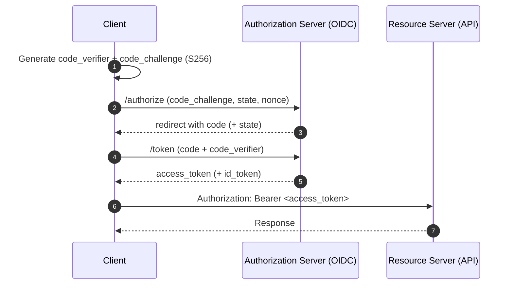
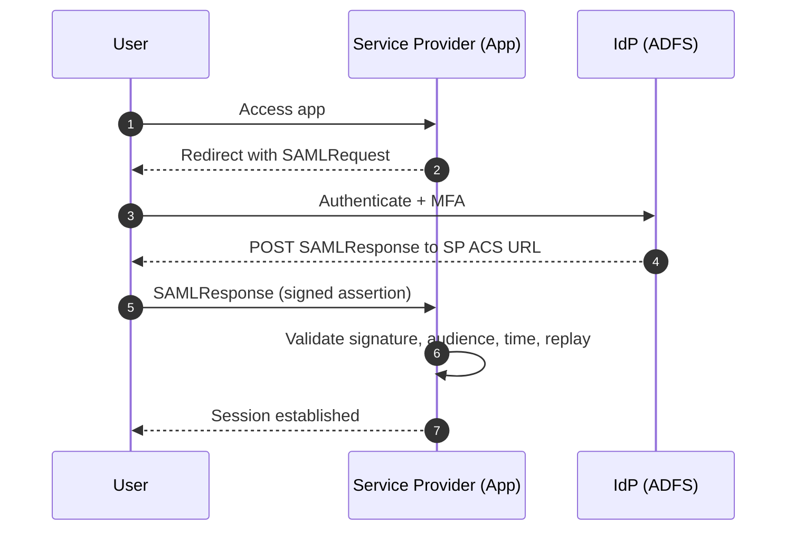

# Identity, Access, and Authentication

This reference covers the identity and access topics that frequently cause security incidents in production:

- IAM design (least privilege, short-lived credentials, boundaries)
- OIDC/OAuth2 and **PKCE** (token validation, replay resistance)
- SAML and ADFS (enterprise federation)
- PKI and certificates (mTLS, rotation)
- PAM (privileged access management, break-glass)

> [!IMPORTANT]
> This is identity-specific guidance. For broader security patterns, also see [owasp-security.md](owasp-security.md).

---

## Non-negotiables

- **Default deny**: access must be explicitly granted
- **Least privilege**: minimal actions, resources, and time
- **Short-lived creds**: prefer federation/workload identity over long-lived keys
- **No secret material in logs**: never log passwords, tokens, cookies, private keys, SAML assertions
- **Validate authenticity**: signatures, issuer, audience, and time bounds are mandatory checks

---

## IAM (cloud access control)

### Safe defaults

- Prefer **roles** over users for automation and workloads
- Prefer **scoped roles** per app and environment (dev/staging/prod)
- Use **conditions** and **boundaries** to reduce blast radius (ABAC, MFA requirements, session duration limits)

### Anti-patterns to avoid

- `Action: "*" + Resource: "*"`
- Shared “god roles” used by multiple apps
- Long session durations by default
- Static access keys in CI, repos, or local shell history

---

## OIDC/OAuth2 with PKCE

### Recommended baseline (public clients)

- Authorization Code flow + **PKCE (S256)**
- Use `state` and `nonce`
- Strict redirect URI allowlist

### Token validation checklist (APIs)

- Validate **signature** (JWKS + `kid`), handle key rotation
- Enforce `iss` and `aud`
- Enforce `exp` / `nbf` (small clock skew only)
- Never accept tokens in query strings

> [!CAUTION]
> Do not treat an ID token as an access token.

---

## SAML and ADFS

### Service provider validation checklist

- Validate XML **signature** against trusted IdP cert(s)
- Validate audience, recipient/ACS URL, and time bounds
- Enforce replay protection (assertion ID)

---

## PKI (certificates, keys, mTLS)

- Treat private keys as secrets (store in secret managers/HSM where appropriate)
- Automate cert issuance/renewal where possible
- Track inventory and alert before expiry
- For mTLS: validate chain, SAN identity, and EKU constraints

---

## PAM (Privileged Access Management)

- Prefer **just-in-time access** over standing privileges
- Require strong MFA for privileged actions
- Record privileged sessions and produce tamper-evident audit logs
- Maintain a break-glass path with strict monitoring and post-use rotation

---

## Quick review checklist

- [ ] Default deny and least privilege enforced
- [ ] Short-lived credentials preferred over static secrets
- [ ] Token/assertion signatures validated
- [ ] Issuer + audience validation implemented
- [ ] Replay protections implemented where relevant
- [ ] No secrets logged (tokens, assertions, private keys)
