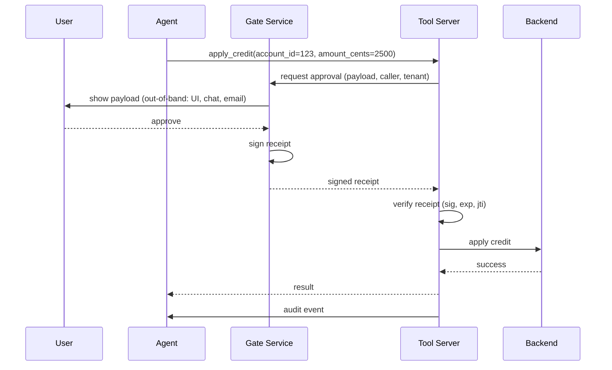

# Human-in-the-Loop (HITL) Gates

Design, sequence, and receipt format for HITL gates on destructive or irreversible actions.

---

## When an HITL Gate is Required

Any action that is **destructive, irreversible, or high blast radius**:

- Delete, drop, truncate (data)
- Pay, refund, transfer (money)
- Deploy, rollback, scale (infra)
- Publish, send, post (communications)
- Grant, revoke (permissions)
- Push, commit to main, merge (source)
- Execute arbitrary code or SQL
- Any action on more than N entities at once (bulk)

If you can't un-ring the bell quickly and cheaply, gate it.

---

## Anti-pattern: The Model as Approver

```
User: "Can you delete all the flagged accounts?"
Agent: "Sure, confirming: delete 42 accounts. Is that okay?"
User: "Yes"
Agent: [calls delete_accounts(...)]
```

This is **not** HITL. It's a string. Attackers can synthesize that string. A proper HITL gate:

- Runs outside the conversation
- Shows the full payload (not the model's summary)
- Collects a **signed receipt** that the tool layer verifies independently
- Refuses to execute without a valid receipt

---

## Sequence



Key properties:

1. The gate is out-of-band from the agent conversation.
2. The user sees the **real payload**, not the model's phrasing of it.
3. The receipt is signed by the gate, verified by the tool server.
4. The tool server refuses without a matching, unexpired, single-use receipt.

---

## Approval Payload (what the gate shows)

```json
{
  "action": "apply_credit",
  "target": {
    "account_id": "acct_12345",
    "customer_name": "Alice Example",
    "current_balance_cents": 5000
  },
  "change": {
    "amount_cents": 2500,
    "reason": "Requested by support agent for ticket #T-9876"
  },
  "caller": {
    "agent_session": "sess_abc",
    "human_user": "alice.support@acme.com",
    "tenant": "tenant-X"
  },
  "expires_at": "2026-04-19T10:05:00Z",
  "request_hash": "sha256:..."
}
```

UI requirements:

- Human-readable summary (action name, target, change)
- Full JSON available on demand
- Clear approve/deny buttons
- Expiry countdown visible
- Cannot be pre-filled by the caller
- Requires fresh authentication for high-risk actions (step-up, WebAuthn)

---

## Receipt Format (what the tool verifies)

```json
{
  "request_hash": "sha256:...",
  "approver": {
    "user_id": "user_42",
    "auth_level": "webauthn",
    "ip_hash": "..."
  },
  "approved_at": "2026-04-19T10:02:30Z",
  "expires_at": "2026-04-19T10:07:30Z",
  "jti": "unique-receipt-id",
  "signature": "..."
}
```

Signed with a key held only by the gate service. The tool server verifies using the gate's public key.

---

## Tool-Side Verification

```python
def verify_receipt(receipt: dict, expected_request: dict) -> None:
    # 1. Signature
    verify_signature(receipt, GATE_PUBLIC_KEY)

    # 2. Expiry
    if now_utc() > parse(receipt["expires_at"]):
        raise HITLReceiptExpired()

    # 3. Match to the actual request
    expected_hash = hash_request(expected_request)
    if receipt["request_hash"] != expected_hash:
        raise HITLReceiptMismatch()

    # 4. Single-use replay check
    if ledger.has_seen(receipt["jti"]):
        raise HITLReceiptReplay()
    ledger.record(receipt["jti"], ttl=receipt["expires_at"])

    # 5. Approver authority check
    if not is_authorized_approver(receipt["approver"]["user_id"], expected_request["action"]):
        raise HITLUnauthorizedApprover()

def apply_credit(account_id, amount_cents, hitl_receipt):
    request = {"action": "apply_credit", "account_id": account_id, "amount_cents": amount_cents}
    verify_receipt(hitl_receipt, request)
    # ... perform the action ...
    emit_audit("apply_credit", request, hitl_receipt)
```

---

## Timeout and Retry

- **Timeout:** receipt requests expire in minutes (typically 2-10). Longer for async flows.
- **On timeout:** the request is denied; the agent must re-prompt or abandon.
- **Retry:** the agent may retry the *request* (which issues a new receipt request). It may NOT retry with a stale receipt.
- **Rate limit:** per user, per action. Repeated approval prompts are a UX and a security issue.

---

## Approver Authority

Not every user can approve every action. Matrix:

| Action | Approver role |
|---|---|
| `apply_credit` (up to $50) | Support agent |
| `apply_credit` (up to $500) | Support lead |
| `apply_credit` (over $500) | Finance + Support lead |
| `delete_account` | Customer (in their own UI) + Support lead |
| `deploy_production` | Deployer + on-call |
| `grant_admin_role` | Security + Engineering lead (two-person rule) |

The gate enforces this matrix based on the `action` and the authenticated approver's claims.

---

## Audit

Every approval request, approval, denial, and timeout emits an audit event:

```json
{
  "event": "hitl_decision",
  "ts": "2026-04-19T10:02:30Z",
  "request_hash": "sha256:...",
  "action": "apply_credit",
  "caller": "user:alice@acme.com",
  "approver": "user_42",
  "decision": "approved",
  "auth_level": "webauthn",
  "jti": "...",
  "trace_id": "..."
}
```

Store in the append-only WORM audit store (same as other trust-decision events).

---

## Bypass Tests (must pass in CI)

1. **No receipt:** tool rejects with `HITLReceiptMissing`.
2. **Forged signature:** tool rejects with `HITLReceiptInvalid`.
3. **Expired receipt:** tool rejects with `HITLReceiptExpired`.
4. **Replayed receipt:** tool rejects with `HITLReceiptReplay`.
5. **Mismatched request:** receipt for `amount=25` but call is for `amount=2500` - tool rejects with `HITLReceiptMismatch`.
6. **Unauthorized approver:** receipt signed but approver lacks authority - tool rejects with `HITLUnauthorizedApprover`.
7. **Model synthesizes approval:** the agent tries to pass a string like `"approved: yes"` - tool rejects (not a valid receipt).
8. **Race condition:** two concurrent tool calls with the same receipt - one wins, the other gets `HITLReceiptReplay`.

---

## Failure Modes to Avoid

- **Gate in the same trust domain as the caller.** The gate must be independent; otherwise compromising the caller compromises approval.
- **Approval that persists across sessions.** Receipts are per-request, not per-session.
- **Approval that covers a range.** One receipt approves one action on one resource.
- **"I'll just log the approval."** Logging is not enforcement. Verification is.
- **Silent fallback.** On receipt-verification failure, never "log and proceed".

---

## Related

- Rule: `316-zero-trust.mdc` (section 5.5)
- Reference: [mcp-hardening.md](mcp-hardening.md)
- Reference: [agent-design.md](agent-design.md)
