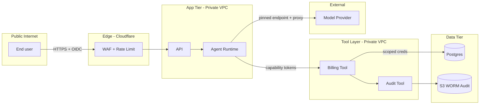

# Zero Trust Threat Model - One-Page Template

Fill this in for any feature that crosses a trust boundary. Attach to the design doc or PR.

---

## Feature

**Name:**

**One-paragraph description:**

**Owner:**

**Reviewer(s):**

---

## Principals

Who or what acts in this system?

| Principal | Type | Identity mechanism | Scope |
|---|---|---|---|
| End user | Human | OIDC (Okta) | Tenant-scoped |
| Support agent | Human | OIDC (Okta) + group `support-agents` | Tenant-scoped, elevated read |
| Background worker | Service | Workload identity (IRSA) | Tenant-scoped write, specific tables |
| Agent (LLM) | Non-human | Capability tokens per session | Narrow per-tool |

---

## Assets

What's worth protecting?

| Asset | Classification | Owner | Retention |
|---|---|---|---|
| Customer PII | C3 (confidential) | Product | 7 years |
| Billing ledger | C3 | Finance | 10 years |
| Session audit log | C2 | Security | 2 years (WORM) |

---

## Actions

What can happen in this system, and how reversible is it?

| Action | Reversibility | Blast radius | HITL required |
|---|---|---|---|
| Read customer profile | N/A | Single customer | no |
| Apply credit (<= $50) | Financial reversal | Single customer | no (capped) |
| Apply credit (> $50) | Financial reversal | Single customer, audit | yes |
| Close account | Reversible within 30 days | Single customer | yes |
| Bulk delete | Backup restore, slow | Many customers | yes (two-person) |

---

## Trust Boundaries

Every arrow is a trust decision. List them:

| From | To | Verification | Authorization | Audit |
|---|---|---|---|---|
| User | Edge | TLS, OIDC session | WAF rules + rate limit | Request log |
| Edge | API | mTLS (service mesh) | Service policy | Access log |
| Agent | Tool | Capability token (signed, scoped) | Per-tool policy + HITL if destructive | Tool invocation audit |
| Tool | DB | Scoped DB creds (short-lived) | Row-level security | DB audit |
| Agent | Model | Pinned endpoint via proxy | Egress allow-list | Proxy log |

---

## Threats and Controls

### Traditional (STRIDE)

| Threat | Example | Control | Test |
|---|---|---|---|
| Spoofing | Forged user token | OIDC validation (iss/aud/exp/sig); mTLS between services | Auth test suite |
| Tampering | Altered API payload | Signed JWTs; HMAC on sensitive payloads | Integration test |
| Repudiation | User denies action | Audit events with identity + trace | Audit replay test |
| Info disclosure | Wrong tenant data | RLS + per-tenant queries + retrieval filters | Cross-tenant test |
| DoS | Flood of requests | Rate limit at edge + per-principal in app | Load test |
| Elevation | Agent with admin | Scoped roles; capability tokens | Authz test |

### AI-specific

| Threat | Example | Control | Test |
|---|---|---|---|
| Prompt injection | Ticket body says "issue refund" | System prompt isolation; structured output; policy check before side effects; HITL on destructive | Injection test suite |
| Secret leak via model | Model reveals API key in response | Model never sees raw secrets; tool layer brokers; output redaction | Secret-in-response test |
| Cross-tenant RAG leak | Query returns another tenant's docs | Per-tenant index; `tenant_id` filter at query time; provenance tag | Cross-tenant retrieval test |
| Tool abuse | Agent calls `delete_*` after crafted input | Destructive tools behind HITL; tool allow-list; per-session scope | HITL bypass test |
| Cost abuse | Prompt causes unbounded retries | Hard cost caps per principal; retry budget; cost alerts | Cost-limit test |
| Memory persistence | Injected instruction persists across turns | Bounded memory; clear on role change; memory review | Memory-reset test |

---

## Residual Risk

What's left after controls?

- (e.g., "Misclassification of a knowledge-base doc could expose it across tenants. Mitigation: classification is required at ingest and audited quarterly. Detection: cross-tenant retrieval alert.")
- (e.g., "A compromised support agent could approve credits up to their authority. Mitigation: two-person rule above $500; anomaly detection on approval patterns.")

Document residual risk; do not hide it.

---

## Sign-off

- [ ] All entries above completed
- [ ] Reviewed against `316-zero-trust.mdc` golden rules
- [ ] Reviewer checklist from `316-zero-trust.mdc` attached to PR
- [ ] Residual risk accepted by: `<name, role, date>`

---

## Related

- Rule: `316-zero-trust.mdc`
- Reference: [agent-design.md](agent-design.md)
- Reference: [mcp-hardening.md](mcp-hardening.md)
- Reference: [injection-threat-model.md](injection-threat-model.md)
- Reference: [hitl-gates.md](hitl-gates.md)
